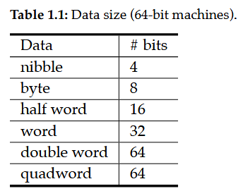
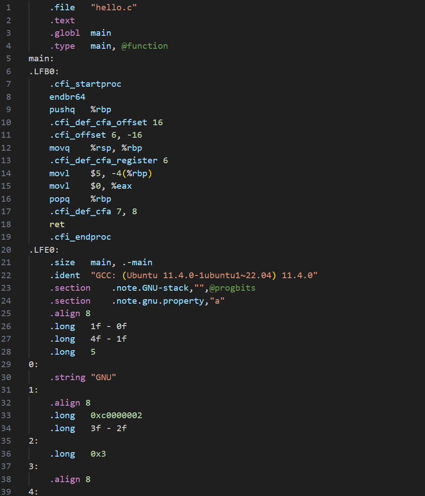

1-time 3-day extension, no questions asked. submit the form on canvas at least a few horus before the deadline.

[class notes](https://stevens0-my.sharepoint.com/:o:/g/personal/shao14_stevens_edu/EusjhIxWjCBNg3XbnfM_uoUBdCeVBiEvmpQzYifPEVDy6A?e=X4YIWA)

data sizes for 64-bit systems:



- MSB = most significant bit
- LSB = least significant bit
- to turn part of an unsigned byte into a full byte, you do zero extension which is just adding zeros in the most significant place until it's 8 bits long
- unsigned bits have a range of [0, 255]
- for signed numbers
  - have a range of [127, -128]
  - the most significant bit is actually negative, then you add the rest together like normal
  - the signed bit is NOT just a negative sign; it is a place with a negative value
  - we know if a number is signed or not from context, there is nothing in the number that nets us know
    - for a number with a leading 0 it doesn't matter; 0100 = 4 whether it's signed or unsigned
    - we only need to worry if it leads with a 1; 1011 = 11 or -5
- for a signed number with d bits, its range is [-2ᵈ⁻¹ , 2ᵈ⁻¹-1]
- when doing zero extension for signed numbers
  - the most significant bit is changing along with its value so we need to make sure the og value is preserved
    - e.g. 1011 = -5 ≠ 10001011 = -117
  - instead we'll append ones
    - e.g. 1011 = -5 = 11111011 = -5
- so when we do sign extension, we duplicate the MSB to the front
  - therefore zero and sign extension are the same thing, as long as you're dealing with signed numbers
  - for unsigned numbers it needs to always be zeros

# 9/9
- how do we go from +5 to -5?
  - we know for them to be sign opposites, the binary representations of +5 and -5 must add to 0
  - remember two's compliment:
  - +5 = 0101
  - flip all bits: 1010
    - 0101 + 1010 = 1111 = -1
  - add 1: -5 = 1011
    - 0101 + 1011 = 0000 = 0 ✓
  - ∴ 1011 is the two's compliment of 0101
  - from negative back to positive you are still *adding* 1

## shifting
- logical shift left (LSL):
  - take `1011` and shift it left one bit, or `LSL(1)`:
    - we can't shift the MSB left since we only have 4 bits, so we discard it
    - we get `0110`
  - 1011 → LSL(3) → 1000
  - each LSL(n) multiplies the value by 2ⁿ
    - until you shift it out of the byte you have and it becomes 0
  - shifting is much quicker & easier for the computer than multiplication, so sometimes it will rewrite multiplication by powers of 2 as shifting
    - e.g. `a * 8` → `a << 3`
- logical shift right (LSR):
  - same idea; move right, discard anything shifted out of the byte, pad 0s
  - 1011 → LSR(2) → 0010
  - each LSR(n) divides the value by 2ⁿ
- arithmetic shift right (ASR):
  - preserves the MSB (signed or not)
    - still moves it though, then pads with copies of MSB
  - 1011 → ASR(2) → 1110

## logic operators
- &&, ||, ! = and, or, not
  - these are logical operators that produce true/false
- &, |, ~ = and, or, not
  - these are bitwise operators that produce binary numbers from binary numbers
  - performs the operation on each corresponding bit of its operand/s and makes a new number as a result
  - a = 1011
  - b = 0101
  - a & b = 0001
  - a | b = 1111
  - ~a = 0100
- now say we have char a = -5 and char b = 3
  - a = 1111011, b = 00000011
  - a|b = 11111011 = -5
- masking - preserving some bits and setting the rest to 0
  - we only care about, per se, the 3rd 4th and 6th bits of a
  - make a new variable mask = 00110100, with 1s is the places you care about and 0s everywhere else
  - now do `a & mask`
    - it will preserve the bits of mask that are 1 and destroy the 0s
  - can be used to check if a specific bit is 0 or 1 by masking it to only that one bit and checking if it's = 0 or not
    - useful if you are storing a bunch of information in one byte to single out one bit of it

## hexidecimal
- starts with `0x` so we know it's hex
- number contains 0-9 then A-F
- 9 = 1001 = 0x9
- 16 = 1111 = 0xF
- each hex digit represents a nibble (4 bits) of binary
- 1010 1111 1100 = 0xAFC
- 1011111100 → 10 1111 1100 ...
  - we need to extend the first group
  - for that, we need to know if this is signed or not
    - if we don't know then it's over
  - assuming it's unsigned, 0010 1111 1100 = 0x2FC
  - if it's signed, 1110 1111 1100 = 0xEFC
  - there are no negative numbers in hex

# 9/10 lab
- c will translate decimal into binary for you when you assign a value to a variable
- a string in a `char*`
- output by `printf("Hello, %d\n", 382)` = `Hello, 382`
- compile your code with `gcc <some_file>.c -o <name_of_output>`
- run it with `./<name_of_output>`

# 9/11
- carry - the truncated place(s) when unsigned binary addition make a number too big to fit into its size
- positive/negative overflow - truncated place(s) when signed binary addition is too big/small for its size
- byte-addressed memory - every byte in memory has a unique address
  - each byte is between 0 and 2⁶⁴ - 1
- an array's first element is at it's lowest address and then it grows upward
  - the name of the array is a pointer to that first array, in 8 bytes (64-bti addressing)

## C Data Types
- char - one byte; the smallest one
- short int - two bytes / half-word
- int - 4 bytes / word
- float 4 bytes / word
- double - 8 bytes
- long int - 8 bytes
- by default they are all signed
- no strings. use a char array
  - `char str[] = "hello";`
  - by default also contains the null terminator character -- completely invisible

## data type signs
- you can specify `unsigned int` etc.
  - not for double or float
- `unsigned char a = -5` will work, technically
  - it will be interpreted as `a = 1111 1011` 
  - which, when read back, will be interpreted as unsigned so `a = 251`
- `for (unsigned int a = 10; a >= 0; a--){};` will never stop running because sn *unsigned* variable can never be < 0
  - the binary will still wrap around from `00000000` to `11111111`, it just depends on how the computer interprets it

## goto
- `goto` lets us do *un*conditional branching
  - can let us skip around blocks of code
  - give some block of code a label, and whenever you want to use it, call `goto <label>`
- given this:
```c
if (a<0){
  S1;
  S2;
} else{
  S3;
  S4;
}
```
- we can do:
```c
if (a>0) goto La;
// we can get rid of the else condition; 
// it won't reach this line unless "else" happens anyway
goto Lb
La: S1;
S2;
goto Lc
Lb: S3:
S4;
Lc: ...
```
- and this second snippet can be easily translated into assembly later
- now if we have:
```c
for(int a=0; a<10; a++){
  S1;
  S2;
}
```
- this can become:
```c
int a = 0;
Loop: 
  if (a>=10){
    goto Out;
  }
  S1;
  S2;
  a++;
goto Loop; 

Out: ...
```

# 9/13 Data Storage

- byte-addressed = 1 byte per address ⇛ amount of unique addresses = amount of bytes that can be stored
- 64-bit implies 2⁶⁴ unique addresses, = amounts of bytes we can store
- range of addresses = [0, 2⁶⁴ - 1]
- every char array used as a string has the amount of characters you give it plus the null terminator
- `char str[]` --> type of `str` = char pointer, `char*`
  - its value is the base address of the first element
- arrays do not have a terminal character
  - they take up only as much data as they contain
- `int arr[]` --> type of `arr` = `int*` to the array's base address
  - the array's next element is ALWAYS the next highest address
- `&` gives you the address of a variable
  - assuming `int arr[] = {10,20,30}` and starts at 0x0
  - `&arr[0]` = 0x0 = `arr` = `arr+0`
    - we get the lowest address, even though 10 takes up the first 4 bytes/addresses by being an int
  - `&arr[1]` = 0x4 = `arr+1`
  - `&arr[2]` = 0x8 = `arr+2`
  - the interpreter knows to move `arr+1` 1 *element* up instead of one *address* up
  - `arr + <n>` is an `int*` just like `arr` by itself
- `*` dereferences a pointer
  - i.e. gives you the value it points to instead of its address
  - `*(arr+0)` = `arr[0]` = 10
  - `*(arr+1)` = `arr[1]` = 20
  - `*(arr+3)` = `arr[2]` = 30
  - `*(arr + <n>)` gives us an int
- we are now never using the good notation again because assembly doesn't have it
- address of the nth element = base address ± n * sizeof(data type)
  - this is how `*(arr + <n>)` works
  - if we really only want to move one byte at a time through `int a`, we can do `(char*)&a + <n bytes>`
    - e.g. the third byte of `int a` stored at 0x1000 would be `(char*)&a + 2`
    - can't add a fraction of a byte to only get part of the way into a variable
  - since we casted it to a char pointer it returns *one* byte from the int
  - if we tried `*((char*)&a + 2)` the machine wouldn't know where the boundary of the variable is
  - `*((int*)((char*)&a + 2))` just grabs the 4 bytes after the third byte of `a`
  - n * sizeof(data type) = *byte offset*

## endianness
- endianness has to do with how multi-byte variables are stored
- little endian: first (lowest) byte is at the lowest memory address
  - when splitting up one value into multiple addresses, it is stored from least significant byte to most significant byte
- big endian: first (lowest) byte is at the highest memory address
- this DOES NOT EFFECT ARRAYS
- we are going to assume little endianness if not specified


## 9/16 Data Storage Cont.
- when you declare a variable with hexadecimal, it's exactly what is stored. 
  - no sign extension happens. 
  - empty bits are filled with 0s
- more pointer arithmetic examples:
  
- this happens because the hardware has no concept of variables and boundaries. it just reads what it sees
- assembly is the closest you can get to just manipulating hardware
- languages like python don't even allow this, others will complain, C doesn't care

# 9/17 lab
- you can downcast with truncation
- you can upcast but it will include garbage

# 9/18 von Neumann
- we can attach as many I/O devices as we want
  - hard drive is an I/O device
  - keyboard, mouse, trackpad, etc are all peripheral devices
    - peripheral b.c. the computer can run without them
  - the RAM and CPU are the essential parts that the computer needs to have
    - otherwise it's not really a computer
- each wire can carry high/low voltage ⇛ 0/1
  - a bus = a big group of wires put together
- the RAM or I/O devices send signals with instructions tot eh CPU over the control bus
- to do 3+2:
  - I/O device reads "3+2"
  - RAM gets "3" "2" and the instruction to add them
  - RAM send "3" and "2" to the register file in the CPU
  - RAM sends addition instruction over control bus to control unit in the CPU
  - ALU (algorithmic logic unit) in the CPU takes 3, 2 and control unit tells it to add them
  - ALU does the addition and produces 5
  - ALU sends 5 to the register file
  - calculation is done
- but now we want to save it...
  - register file sends 5 to RAM over data bus
  - RAM picks a memory address and stores 5 there
- ALU needs to send 5 to the register file before it gets to RAM because it has no direct connection to the RAM
- data bus is bidirectional -- it can send data both ways
- each operation/movement takes one tick of the CPU clock
  - and each operation is one assembly instruction
- data in the CPU is not addressed
  - Data are stored in registers in CPU, and registers use names to refer to, not address.
- data in the RAM is byte-addressed
  - RAM does not store data types or anything of the like -- it is only values or machine code

## intro to assembly
- assembly programs tend to be much longer than higher-level ones
- when we run a C language program:
  - C → compiler → assembly → link → executable binary
  - the compiler automatically turns C into assembly but we'll do it manually
- can compile with `gcc hello.c -S` to get an assembly file
- e.g. 
  ```c++
  int main(void){
      int a = 3+2;
  }
  ```
  becomes:<br>

- it's easy to see if the compiler or human wrote the assembly because the compiler writes very differently

# 9/20
- register file store immediate results of calculations
- ARM64 machines have 32 registers (X0-X31)
  - though X/W31 are special zero registers
- looks like this

- X9 + X10 means we're adding the data from X9 and X10 together
- the lower half of each registry entry is a word (W register)
  - old 32x cpus only has W for words; newer 64x cpus eXtend these to 64 bits
- the *entire thing* is an X register, the lower half included
- register names should be operands
- mnemonic for addition = ADD
- assembly format:
  - (Label:) mnemonic op1, op2, op3, ... //comment
  - we will need to comment every single line
- there are registers WZR and XZR that juts contain zeros.
  - used to clear out a register with MOV
  - you can do `MOV XZR, 382` but it doesn't do anything because XZR will return to 0 anyway
  - these are shortcuts to W31 and X31
  
## MOV
- not case-sensitive
- Syntax: `MOV Xn, simm64` or `MOV Wn simm32`
  - s = signed
  - imm = immediate number
  - 64/32 = amount of bits
  - MOVing a 32-bit number to `Wk` will zero out the higher digits of `Xk`
- keep a diagram of registers and values
- e.g. 
- `MOV Xdst, Xsrc` or `MOV Wdst, Wsrc` will copy data from one register to another
  - both need be be the same of X/W
- `MOV 382, X20` is invalid because you cannot move a register into a number
  - you might have meant `MOV X20, 382` to put 382 into X20
- `MOV 382, 389` is invalid because you can't put a number in a number
- can only MOV things within the register file
  - most data is stored in RAM
  - we need to move it to/from RAM and CPU
  
## LDR
- LDR = load register
- CPU needs to send the needed address to the RAM and to retrieve the data
- Syntax: `LDR Wt/Xt [base,simm9]` loads a word/double word from memory addressed by base+simm9 to Wt/Xt;
  - Wt/Xt is the destination
  - brackets mean you want accessible memory
  - base = base address
    - must be an X register bc addresses are 64 bits long
  - simm9 = *byte* offset in 9 bits
    - offsets you into the data at the address
  - can load a W into an X / X into a W
    - zeros out top half
- Syntax: `LDR Wt/Xt, [Xn,Xm]` 
  - loads a word/double word to Wt/Xt (respectively) from memory address Xn+Xm
- Extended syntax: `LDR[S]{H|B} Wt, [base, simm9]`
  - S: use sign extention (optional)
    - i.e. duplicates most significant *bit* (not leading hex digit)
    - uses zero extension otherwise
    - necessary to think about because a half word/byte will not fill the W register (4 bytes)
  - H: load a half word/nibble, B: load a byte (optional)
  - has to load to a W register
  - examples: 
  
# Assembly Programs

- this program doesn't actually print anything, it just ends itself
  - these 3 lines are used to end the program
- assembly programs have text and data segments
  - `.text` segment contains code, instructions to be carried out
  - `.data` segment declares data
  - can be in any order as long as they are separate
- `_start:` is a **label** like for goto and is equivalent to a `main` function
- variable names are also labels; `hello_str: .ascii "Hello World!\n\0"`
- under `.text` we need `.global _start` to tell to OS where to start running the program
- all of these `.name` lines are **directives**
  - they are not code
  - like a `#include <xyz>` in C++, it is for the compiler, not the final executable

## .text
- `MOV X0, 0` tells the system that status is normal
  - OS checks X0 for the status of the program upon exit
- `MOV X8, 93` is saving the number to call a system service, here it's 93 which is terminating the program normally
- `SVC 0` actually calls for the system service, using the number in register X8
  - it's always X8

## .data
- `hello_str: .ascii "Hello World!"`
- Declaring a variable syntax: `label: .type_directive data1, data2, ...`
  - label is any valid label
    - will point to the base address of the data assigned
  - .type_directive: 
    - tells us how much space each piece of data takes
  - data1, data2, ...: data
    - ascii must be declared `"Content\0"`, including the null terminator
    - strings can be declared as `"usual"`
      - the label of the string points to the location of `"u"`
    - arrays are declared with type and no delimiters, e.g. `arr: .quad 80302, 01230, 07030` 
      - `arr` points to the location of element 0, `80302`
- all data declared in the `.data` segment are stored sequentially
  ```as
  str: .string "Hello"
  arr: .quad 80302, 01230, 07030
  vec: .int -100
  ```
  - for example, `str + 5` = `arr` = `80302`

# ADR
- gets the data from an address into a register
- Syntax: `ADR dst, label`
  - `ADR X9, arr` loads the address of arr into X9
- `LDR X10, [X9]` then loads the *content* of `arr[0]` into X10
- `LDR X10, [X9, 8]` loads `arr[1]` into X10
  - 8 = byte offset between quads, which arr is made of

# STR

- lets you store something from the CPU into RAM

# Calculating
- Addition: ADD
  - Syntax: `ADD Xd, Xn, Xm`
  - stores the result of Xn + Xm into Xd
  - *one* of Xn and Xm can be an immediate
- Subtraction: SUB, and Multiply, MUL have the same syntax
- SDIV, UDIV for signed and unsigned division operations
- LSL (logical shift left)
- LSR (logical shift right)
- ASR (arithmetic shift right)
- AND (logical AND)
- ORR (logical OR)
- EOR (logical XOR)

# Branching (Flow Control)
- unconditional branching with B = goto
  ```as
  MOV ...
  ADD ...
  B L1
  SUB ... //this line never runs
  L1: LDR ...
  ```
- let's say we start with:
  ```c
  long int a;
  if (a==4) a++;
  else a--;
  ```
- we can rewrite it with `goto`:
  ```c
  long int a;
  if (a==4) goto L1;
  else goto L2;

  L1: a++;
      goto end;
  L2: a--

  end: ...
  ```
- we can rewrite `if (a==4)` as `if (a-4==0)` arithmetically
- Syntax: `CBZ Xt, Label`
  - if the content of Xt **==** 0, goto Label; else move to the next instruction.
- Syntax: `CBNZ Xt, Label`
  - if the content of Xt **!=** 0, goto Label; else move to the next instruction.
- these let us translate that original C++ code into:
```as
// we have loaded long int a into X9
    SUB X10, X9, 4 // X10 = a-4
    CBZ X10, L1    // if X10 == 0 goto L1
    B   L2         // else goto L2

L1: ADD X9, X9, 1  // a++
    B   End
L2: SUB X9, X9, 1  // a--
End:
```

## Translating For loops
```c++
for (int i = 0; i < 5; i++){}
```
is the same as
``` c++
int i = 0;
loop: 
if (i<5){
  i++;
  goto loop;
}
```
is the same as
```c++
int i = 0;
loop: 
  if (i==5) goto End;
  i++
  goto loop
End:
```
which can be turned into assembly line-by-line:
```as
MOV X0, 0       // X0: int i = 0
SUB X1, X0, X5  // X1 = i-5
Loop:
CBZ X1, End     // if (i-5 == 0) goto End;
ADD X0, X0, 1   // i++
B   Loop        // goto Loop
End:
...
```

## 
- null terminator's ascii value is 0
- lowercase letters are stored immediately uppercase
  - add 32 to an uppercase letter to get its lowercase equivalent
  - and subtract for vice versa

```as
.data
  msg: .string "hello" // we want this to become "HELLO"
.text
.global _start
_start:
  MOV  X0, 0          // X0 index/byte offset
  ADR  X1, msg        // X1: base

Loop:
  LDRB W2, [X1, X0]   // W2 ← msg[i]
  CBZ  X2, End        // if (X2 == 0) goto End;
  SUB  W2, W2, 32     // W2 ← W2 - 32
  STRB W2, [X1, X0]   // msg[i] ← W2
  ADD  X0, X0, 1       // i++
  B Loop              // goto loop
End:
...
```

# Machine Code
- each instruction is a 4-byte binary
- the instructions are loaded into RAM
  - which means each instruction has an address
  - loaded in sequentially
- we know the code starts at label `_start`
- PC = program counter
  - has as 64-bit register
  - stores the address of the next instruction
1. cpu retrieves the address of the first instruction from the PC
2. pc retrieves the 4 bytes of instruction
3. pc loads the next instruction into the CPU
4. pc increments its counter by 4 bytes
   1. unless it reaches a CBZ where it might go directly to a labeled instruction's byte

# 9/30 Branching
## CPSR, Current Program Status Register
- has 32 bits but we only care about the 4 MSBs right now
  - 31 = N = Negative
    - 1 iff result from last operation is negative, else 0
    - AKA copy of the result's MSB
  - 30 = Z = Zero
    - 1 iff result from last operation is 0, else 0
  - 29 = C = Carry
    - 1 iff result from last operation is greater than the limit of the data type, else 0
    - AKA the extra bit we need to carry out of the result
  - 28 = V = Overflow
    - 1 iff result from last operation is too large to fit in a signed bit, else 0
    - will never get an overflow when adding a positive and negative together
- `ADDS` will set condition codes for its results, `ADD` doesn't
  - same deal for `SUBS` vs `SUB` and `ANDS` vs `AND`.

## CMP
- Syntax: `CMP Xn, Xm` or `CMP Wn, Wm`
- or with immediates, `CMP Wn/Xn imm12`
- subtracts the second argument from the first, then set all condition codes in the CPSR about the result
- effectively does the same thing as `SUBS`, but `CMP` doesn't store the result of the multiplication into a register, while `SUBS` does

## B.cond
- Syntax: `B<.cond> Label`
  - `B` always jumps to Label
  - `B.cond` jumps iff its condition is fulfilled, otherwise nothing.
    - i.e. calls with conditions that are unfulfilled are skipped over
- comparisons and their equivalent B operations:

  - **notice that most commands are different for different signedness**

# 10/2 Process Image
- shows the addresses in memory a program takes
  
  - unused is unused
  - `.text`, `.data`, and `.bss` parts are the assembly code
  - heap stores anything that gets created during runtime
    - like anything declared with `new`
    - ie.. stores dynamic data
      - assembly parts store static global data
  - stack stores procedure calls and local variables
    - anything added to the stack grows down into the empty space
    - outermost function call is at the bottom, innermost is at the top (gets finished first)
    - SP register X29 points to the top (physically bottom) of the stack 
      - can add and subtract X29's value to move up/down the stack
- assembler (compiler) turns asm code into object file (made of machine code/binary)
  - object has `.text` and `.data` but it's in binary
- we can link object files with a linker
  - merges all of the `.text` and `.data` into one big executable
- text editors will try to translate the binary into ASCII characters, and sometimes those characters don't exist
  - if we want to see the actual binary
  - generate listing file by `aarch64-linux-gnu-as demo.s -a=demo.lst`
  - then `cat demo.lst` will show assembly and machine code side-by-side
  - 
    - notice the hex values next to the declaration of `"Hello World!\n"` are all of the ASCII codes for each character (plus `\0` = `0x00` at the end)